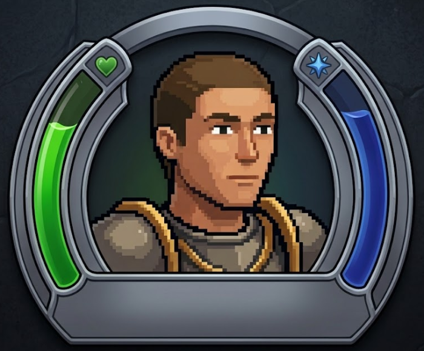
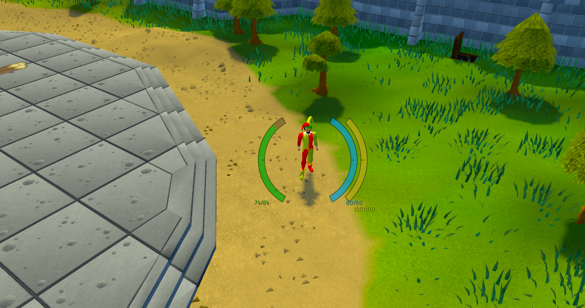

  

# Arc Vitals

A vitals HUD for RuneLite, inspired by IceHUD. Curved bars sit either side of
your character and follow the curve as they fill and drain, so you can watch your
hitpoints and prayer without dragging your eyes down to the orbs.

## Features

- Up to four bars: hitpoints, prayer, special attack and run energy. Each one
  gets its own colour, side and low threshold, and you can turn each on or off.
  Put two on the same side and they nest one outside the other. Special attack
  and run energy start switched off.
- A value readout under each bar. Show the current and max, a percentage, both,
  or nothing at all.
- Hover a bit of food or a potion and the bar shows how much it would heal you,
  drawn as a lighter segment above the current fill.
- Low-stat alerts. A bar brightens once it drops past the threshold you set, and
  it can flip to a warning colour too. Have the alert on each bar, across the
  whole HUD, or off.
- The hitpoints bar darkens while you're poisoned and darkens further under
  venom. Both colours can be changed.
- Flat or rounded bar ends, an optional outline, and a resting opacity so the
  whole thing can fade back when you're not looking at it.
- If you'd rather only see it mid-fight, there's an option to hide the HUD once
  you've been out of combat for a few seconds. Keep a prayer running and it can
  hold the prayer bar (or the whole HUD) on screen so the drain doesn't go
  unnoticed.

## Getting started

Install Arc Vitals from the Plugin Hub and turn it on. You start with two bars,
hitpoints on the left and prayer on the right. Everything past that stays off
until you want it.

## Configuration

Open the plugin settings to change any of this. Layout is where the HUD sits plus
the height, thickness, gap and curve of the bars. Each bar then has its own small
section for colour, side and threshold. The rest is split across Appearance (bar
ends, outline, value text, opacity), Alerts (the low-stat warning and its
colour), and Visibility (the out-of-combat hide, how long it waits, and whether
an active prayer keeps the prayer bar or the whole HUD up). A Debug section at
the bottom fakes bar values and poison states, so you can preview colours and
thresholds without getting yourself poisoned for real.

### Bar styles

Two more dropdowns control how the bars are drawn. Bar shape, in Layout, switches
between the curved arcs and plain straight vertical bars. Fill style, in
Appearance, switches the fill between a solid colour, a glossy rounded-tube
highlight, a bright-to-dark gradient, segmented pips, a glowing core, or notches
marking the 25/50/75% points.

Each bar's own section carries the same two dropdowns, both set to Inherit by
default so they follow the global choice. Switch either one to override just
that bar.

## Notes

The HUD is pinned to the middle of the game view rather than to your character,
because the game doesn't keep your character dead centre on screen. One thing to
watch for: in Stretched Mode the bars get scaled up along with the rest of the
interface and go a bit soft. Switch Stretched Mode off and they're sharp again.
